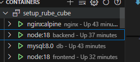

### LINGUAGENS _ JAVASCRIPT AND TYPESCRIPT
### FRAMEWORK _ EXPRESS JS

### 1. **Clone os Arquivos do Repositório**

```sh
git clone https://github.com/rnbruno/setup_rube_cube app-rube_cube
```
- **Descrição**: Implementar um ambiente isolado e portátil para a aplicação em contêineres para simplificar o desenvolvimento, a implantação e a escalabilidade.
- **Tecnologias Utilizadas**:
- 
- WSL2 No windows;
- Ubuntu 22;
- 
- Docker para criação, gerenciamento e execução dos contêineres.
- docker-compose.yml: para configuração dos serviços
- Containers Configurados:
Backend (API ou servidor de aplicação).
Banco de dados (MySQL).
Ferramentas adicionais (Nginx) servir a aplicação.
- **Comentário**: a solução facilidade na reprodução do ambiente em diferentes máquinas e cria um Isolamento de dependências.
  
### 2. **Iniciando container**

- docker-compose up -d
  
  

- **Tecnologias Utilizadas**:
- No back - end instalamos o expressj
  
-Iniciando containners de front, back, nginx e mysql

http://localhost:3031 
```front-end
http://localhost:3030 
```back-end

-npm install --save-dev nodemon 
#para auxiliar na atualização de código 

Para capturar os logs 

Instalo o axios
```
npm install axios
```

Criando pastas de public, src, modals

```
npm update para os containers
```

```
Utilizei um dashboard no nuxt.js neste Github
```
###https://github.com/story2Dev/nuxt3-admin-dashboard
