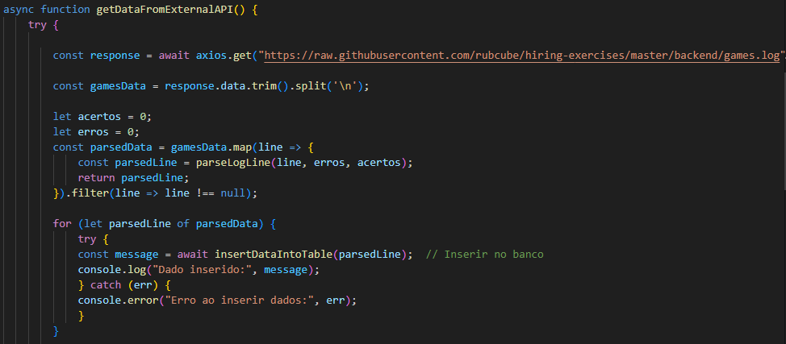
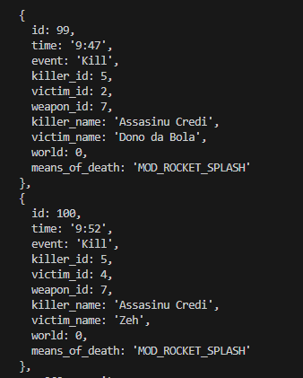
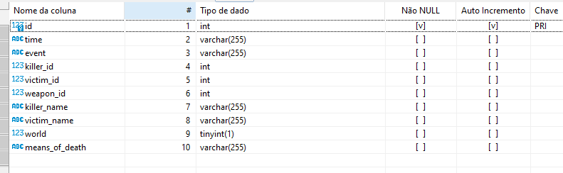
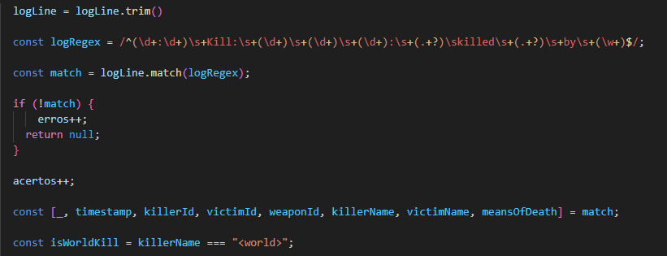
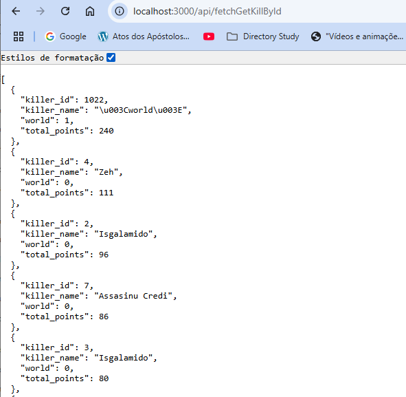
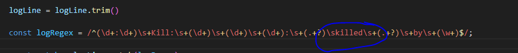
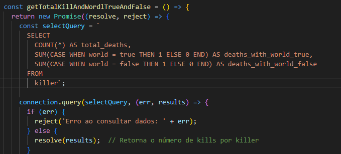
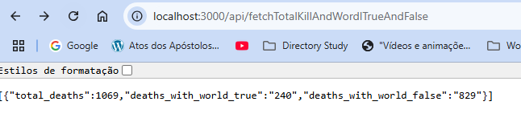

# Roadmap

O ROADMAP a seguir descreve as etapas planejadas do projeto, incluindo as histórias atendidas e o que poderia ser adicionado.

## Histórias Atendidas e Descrição

Neste tópico descreveremos as histórias que foram implementadas. As funcionalidades atendidas serão descritas a baixo. 

### 1. **História: Integração com Banco de Dados E API externa**
   - **Descrição**: Implementamos a lógica de integração com o banco de dados para armazenar dados relacionados aos eventos de jogo, como "Killers", "Kills" e caso tenha a chave <world>.
   - **Como foi atendido**: Ao iniciar o serviço no servidor com docker-compose o container-name backend é iniciado. Ao dividir em MVC os sistema tempos pastas para db - acesso ao banco de dados, services - acesso a api externa, controller - para armazeCriamos um acesso ao banco configurado.
   - Chamamos a function checkAndCreateTable para verificar se a tabela killer existe. 
   - Caso exista passamos a verificar se existem mais de 100 registro na tabela, se sim chamado SELECT de todos os dados de "killer" por padrão e exposta na API.
   - Caso não é realizada uma chama via axios para página https://github.com/rubcube/hiring-exercises/blob/master/backend/games.log demandada para o projeto. 
   
   
   
   - Os dados são tratados¹ e convertidos em json para posterior inserção na tabela killer.
   
   
   
   - - Os dados inseridos na tabela killer.
   
   

   -¹ Tratamento 
   
   

### 2. **História: Exposição de Dados via API**
   - **Descrição**: Criamos uma API que retorna diversas consultas considerando a tabela killer.
   - **Como foi atendido**: Utilizamos o Express para criar a API e consultamos os dados da tabela killer e administradas em rotas especificas para cada fim. Listagem de todos assassinos, listagem geral, listagem contando todos com world e sem.
   
   

### 3. **História: Envio de Dados para uma API Externa**
   - **Descrição**: Implementamos algumas funcionalidades.
   - **Como foi atendido**: Usamos a biblioteca Axios para enviar os dados obtidos do banco de dados para outra API em formato JSON.

   **Function 1**: total de mortes, mortes por causa e mortes causadas pelo <world>
   **Descrição**: Total de mortes considerando as primeira tarefa do project em todos os itens de https://github.com/rubcube/hiring-exercises/blob/master/backend/games.log. Como na filtragem inserimos no banco somente os itens killers²
   
   
   
   **SQL QUERIES**: 
   
   

   **Endpoint**: [GET /api/getKillCountByKillerAndWorld](http://localhost:3000/api/getKillCountByKillerAndWorld)

   **Resultado da API getKillCountByKillerAndWorld**: mortes por causa

   

   **Function 3**: mortes causadas pelo <world>

## O Que Eu Adicionaria Se Tivesse Mais Tempo

Se tivéssemos mais tempo, eu adicionaria as seguintes funcionalidades:

1. **Autenticação e Autorização**
   - Implementaria um sistema de autenticação (JWT ou OAuth) para garantir que apenas usuários autorizados possam acessar certas rotas da API.

2. **Validação de Dados**
   - Adicionaria validação mais robusta nos dados de entrada e nas respostas, usando bibliotecas como `Joi` ou `express-validator`.

3. **Testes Automatizados**
   - Criaria testes unitários e de integração para garantir que as funções de API e banco de dados estejam funcionando corretamente. Isso pode ser feito com ferramentas como Jest ou Mocha.

4. **Documentação Completa da API**
   - Usaria ferramentas como Swagger para documentar automaticamente as rotas e os dados da API, tornando a integração mais fácil para outros desenvolvedores.

5. **Melhorias no Desempenho de Consultas**
   - Implementaria indexação nas tabelas do banco de dados para otimizar as consultas e garantir que a API responda rapidamente, mesmo com grandes volumes de dados.

## O Que Eu Faria Diferente Se Tivesse Mais Tempo

Se tivesse mais tempo, consideraria as seguintes melhorias e mudanças no processo de desenvolvimento:

1. **Estrutura de Código**
   - Refatoraria a estrutura do código para garantir uma separação mais clara de responsabilidades. Por exemplo, poderia mover a lógica de banco de dados para um arquivo separado e seguir padrões de arquitetura como MVC ou Repository para facilitar a manutenção a longo prazo.

2. **Tratamento de Erros**
   - Melhoraria o tratamento de erros nas funções de banco de dados e API, para garantir que erros sejam logados e que o cliente receba respostas mais úteis em caso de falha.

3. **Implementação de Cache**
   - Adicionaria um mecanismo de cache (como Redis) para evitar consultas repetidas ao banco de dados, melhorando o desempenho da API.

4. **Logs e Monitoramento**
   - Implementaria ferramentas de monitoramento e logging, como `Winston` ou `Morgan`, para registrar as operações da API e facilitar o rastreamento de problemas e performance em produção.
