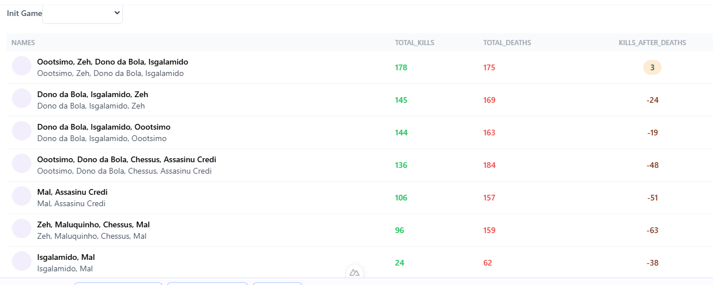

# Roadmap

O ROADMAP a seguir descreve as etapas planejadas do projeto, incluindo as histórias atendidas e o que poderia ser adicionado.

## Histórias Atendidas e Descrição

Neste tópico descreveremos as histórias que foram implementadas. As funcionalidades atendidas serão descritas a baixo. 

### 1. **História: Integração com Banco de Dados E API externa**
   - **Descrição**: Implementamos a lógica de integração com o banco de dados para armazenar dados relacionados aos eventos de jogo, como "Killers", "Kills" e caso tenha a chave <world>.
   - **Como foi atendido**: Ao iniciar o serviço no servidor com docker-compose o container-name backend é iniciado. Ao dividir em MVC os sistema tempos pastas para db - acesso ao banco de dados, services - acesso a api externa, controller - para armazeCriamos um acesso ao banco configurado.
   - Chamamos a function checkAndCreateTable para verificar se a tabela killer existe. 
   - Caso exista passamos a verificar se existem mais de 100 registro na tabela, se sim chamado SELECT de todos os dados de "killer" por padrão e exposta na API.
   - Caso não é realizada uma chama via axios para página https://github.com/rubcube/hiring-exercises/blob/master/backend/games.log demandada para o projeto. 
   
   
   
   - Os dados são tratados¹ e convertidos em json para posterior inserção na tabela killer.
   
   
   
   - - Os dados inseridos na tabela killer.
   
   

   -¹ Tratamento 
   
   

### 2. **História: Exposição de Dados via API**
   - **Descrição**: Criamos uma API que retorna diversas consultas considerando a tabela killer.
   - **Como foi atendido**: Utilizamos o Express para criar a API e consultamos os dados da tabela killer e administradas em rotas especificas para cada fim. Listagem de todos assassinos, listagem geral, listagem contando todos com world e sem.
   
   

### 3. **História: Envio de Dados para uma API Externa**
   - **Descrição**: Implementamos algumas funcionalidades.
   - **Como foi atendido**: Usamos a biblioteca Axios para enviar os dados obtidos do banco de dados para outra API em formato JSON.

   **Task 1**: ADM see total de mortes, mortes por causa e mortes causadas pelo <world>
   **Descrição**: Total de mortes considerando as primeira tarefa do project em todos os itens de https://github.com/rubcube/hiring-exercises/blob/master/backend/games.log. Como na filtragem inserimos no banco somente os itens killers²
   
   
   
   **SQL QUERIES**: 
   
   

   **Endpoint**: [GET /api/getKillCountByKillerAndWorld](http://localhost:3000/api/getKillCountByKillerAndWorld)


   **Resultado da API getKillCountByKillerAndWorld**: mortes por causa

   


   **Task 2**: Player <world>
 
   ```
   Os jogadores começam com zero pontos
   A cada kill o jogador ganha um ponto
   A cada morte pelo mundo o jogador perde um ponto
   É permitido pontuação negativa
   O <world> não deve entrar no ranking de jogadores
   Os jogadores podem mudar de nome no meio da partida, mas só o último nome deve ser considerado no ranking
   ```
   ***Observations***
   - Total de 1069 itens kills
   - 240 killer for <world> 
   ***Item 1***
   - A cada kill o jogador ganha um ponto
   
   ***Item 2***
   - A cada morte pelo mundo o jogador perde um ponto
 
   ***Item 3***
   - É permitido pontuação negativa
  
   ***Item  4***
   - O <world> não deve entrar no ranking de jogadores
  
   **SQL QUERIES**: 
      
   

   **Endpoint**: [GET /api/getKillCountByKillerAndWorld](http://localhost:3000/api/fetchRankingWithNameAlteredInTime)


   **Resultado da API fetchRankingWithNameAlteredInTime**: Ranking some Name altered

   


   **Task 3**: Statistics for Play<world>
   -Eu como administrador do jogo, quero poder consultar as estatísticas de um jogo específicou ou de todos os jogos de maneira estruturada por uma API para montar uma visualização para os jogadores

   ***Observations***
    - Observamos o item Initgame.
    
   
  
    - Foi necessário alterar a lógica de inserção dos dados na tabela killer para inserir outro campo init_game 
     
   

    - e registrar qual é o jogo específico para cada registro.
     
   
  
    - Registramos na tabela killer 

   


   **Endpoint**: [GET /api/fetchRankingWithNameAlteredForInitGame](http://localhost:3000/api/fetchRankingWithNameAlteredForInitGame)
   OR
            [GET /api/fetchRankingWithNameAlteredForInitGame](http://localhost:3000/api/fetchRankingWithNameAlteredForInitGame?initGame=n) n = number

   **Resultado da API fetchRankingWithNameAlteredForInitGame**: Rankin for initGame

   ***initGame is null***

   

   ***initGame is not null ***

      

   ***Item 1***
    - A cada kill o jogador ganha um ponto
    - 
   ### 4. **História: Dashboard Sample** 
   - Adicionei um front estilo dashboard simples

     
   
   - Ao selecionar um item no Selecionável uma nova chamada API é realizada para
   ```
   /api/fetchRankingWithNameAlteredForInitGame initGame = number
   ```


## O Que Eu Adicionaria Se Tivesse Mais Tempo

Se tivéssemos mais tempo, eu adicionaria as seguintes funcionalidades:

1. **Autenticação e Autorização**
   - Implementaria um sistema de autenticação (JWT ou OAuth) para garantir que apenas usuários autorizados possam acessar certas rotas da API.

2. **Validação de Dados**
   - Adicionaria validação mais robusta nos dados de entrada e nas respostas, usando bibliotecas como `Joi` ou `express-validator`.

3. **Testes Automatizados**
   - Criaria testes unitários e de integração para garantir que as funções de API e banco de dados estejam funcionando corretamente. Isso pode ser feito com ferramentas como Jest ou Mocha.

4. **Documentação Completa da API**
   - Usaria ferramentas como Swagger para documentar automaticamente as rotas e os dados da API, tornando a integração mais fácil para outros desenvolvedores.

5. **Melhorias no Desempenho de Consultas**
   - Implementaria indexação nas tabelas do banco de dados para otimizar as consultas e garantir que a API responda rapidamente, mesmo com grandes volumes de dados.

## O Que Eu Faria Diferente Se Tivesse Mais Tempo

Se tivesse mais tempo, consideraria as seguintes melhorias e mudanças no processo de desenvolvimento:

1. **Estrutura de Código**
   - Refatoraria a estrutura do código para garantir uma separação mais clara de responsabilidades. Por exemplo, poderia mover a lógica de banco de dados para um arquivo separado e seguir padrões de arquitetura como MVC ou Repository para facilitar a manutenção a longo prazo.
